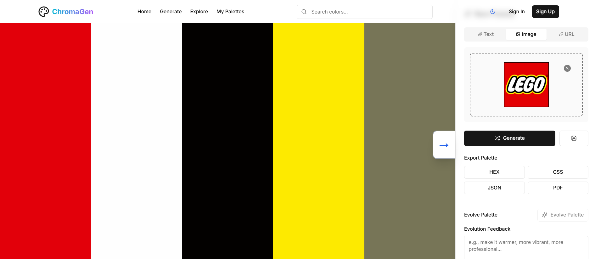
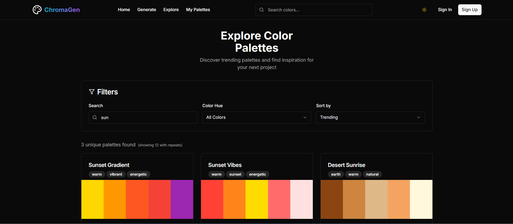

<p align="center">
  
  
  
  
  
  
  
</p>

<h1 align="center">ChromaGenz</h1>

<p align="center">
  <strong>AI-Powered Color Palette Generator — Create, Explore & Export Beautiful Color Schemes</strong>
</p>

<p align="center">
  <em>Generate stunning, accessible color palettes from text prompts, images, or URLs using AI. Built for designers, developers, and creative professionals who demand precision and speed.</em>
</p>

---

## Screenshots

### Generate Page — Image Upload Mode
Upload any image and ChromaGen will extract the dominant color palette using K-Means clustering. The example below shows a LEGO logo upload — the app automatically extracts **Red**, **White**, **Black**, **Yellow**, and **Olive** as the 5 dominant colors. You can also type a **text prompt** (e.g., *"sunset colors"*, *"ocean vibes"*) to generate AI-driven palettes.

<p align="center">
  
</p>

### Explore Page — Discover Trending Palettes
Browse, search, and filter through curated and community-created color palettes. Filter by **color hue**, **search by name/tags**, and **sort by trending, popular, recent, or A-Z**. Each palette card shows its colors, name, and mood tags at a glance.

<p align="center">
  
</p>

---

## Key Features

### AI-Powered Palette Generation
- **Text-to-Palette** — Describe a mood, theme, or concept (*"tropical sunset"*, *"minimalist modern"*, *"elegant luxury"*) and our Groq LLaMA 3.3 70B model generates a matching seed color, then builds a complete harmonious palette around it.
- **Image Color Extraction** — Upload any image (PNG, JPG, GIF, WebP up to 10MB) and extract the 5 dominant colors using **K-Means clustering** with scikit-learn. Perfect for pulling brand colors from logos, photos, or artwork.
- **🔗 URL Color Extraction** — *(Currently under development — not fully functional yet)* — Enter a website URL to extract its color scheme. Currently uses hardcoded palettes for demo sites (Vercel, Stripe, Linear); full scraping support is in progress on the `backend` branch.

### Palette Evolution
- Modify your generated palette with **natural language feedback** — tell the AI to "make it warmer", "increase contrast", "more professional", or "shift towards blue". The LLaMA model intelligently adjusts each color while maintaining harmony.
- Set a **target mood** for evolution to guide the AI's adjustments.

### Palette Analysis & Tools
After generating a palette, ChromaGen provides a full suite of analysis tools:

| Tool | Description |
|------|-------------|
| **Website Preview** | See your palette applied to a realistic website mockup — automatically assigns colors to navbar, background, text, buttons, and cards based on luminance |
| ** Palette Variations** | Generate **Shades**, **Hue Shifts**, **Temperature Shifts** (warmer/cooler), **Color Blindness simulations**, and **Luminance** variations of your palette |
| ** Gradient Viewer** | Preview smooth gradients created from your palette colors |
| ** Accessibility Checker** | WCAG contrast ratio checking (AA and AAA levels) between all color pair combinations |
| ** Color Blindness Simulator** | Simulate how your palette appears to people with **Deuteranomaly**, **Protanomaly**, **Tritanopia**, and **Tritanomaly** |
| ** Color Psychology (AI)** | Get AI-generated analysis of each color's psychology, cultural meaning, design applications, and emotional impact |

### Export Options
Export your palette in multiple developer-friendly formats:
- **HEX** — Copy all hex codes to clipboard
- **CSS** — Get ready-to-use CSS custom properties (`:root { --color-1: #hex; ... }`)
- **JSON** — Full color data with hex, RGB, and HSL values
- **PDF** — *(Coming soon)*

### Dark / Light Mode
Full theme support powered by `next-themes` with system preference detection.

### Authentication
- **Google OAuth** and **GitHub OAuth** via NextAuth.js
- Credential-based sign-up/sign-in with bcrypt password hashing
- Role-based access (User / Admin) — admins can create and manage community themes

### Save & Manage Palettes
- Save generated palettes to your personal collection (`/palettes`)
- Share palette links, copy color codes, edit, or delete saved palettes
- Tag palettes for easy organization

### Explore & Discover
- Browse 30+ trending & curated palettes + community-created themes from MongoDB
- **Smart filtering** — search by name/tag, filter by color hue (Red, Orange, Yellow, Green, Blue, Purple), sort by Trending / Popular / Recent / A-Z
- **Infinite scroll** with lazy loading for seamless browsing

---

## Architecture Overview

ChromaGen is a **full-stack application** with a decoupled frontend and backend:

```
chromagenz/
├── Frontend (this branch — main)
│   ├── Next.js 13 (App Router)
│   ├── TypeScript + Tailwind CSS
│   ├── MongoDB (user auth, themes)
│   └── Prisma (PostgreSQL — palettes)
│
└── Backend (separate branch — backend)
    ├── Flask + Python 3.12
    ├── Groq LLaMA 3.3 70B (AI text-to-color, evolution, explanations)
    ├── scikit-learn (K-Means clustering for image color extraction)
    └── Deployed on Render
```

> **Note:** The Python backend lives in a **separate Git branch** named `backend`. It is deployed independently on Render at `https://chromagenz.onrender.com`. The frontend on `main` calls this backend API for all AI/ML features.

---

## Tech Stack

### Frontend
| Technology | Purpose |
|---|---|
| **Next.js 13** (App Router) | React framework with server-side rendering and file-based routing |
| **TypeScript** | Type-safe development across the entire frontend |
| **Tailwind CSS 3.3** | Utility-first styling with custom ChromaGen color tokens |
| **Radix UI** | Accessible, unstyled primitive components (Dialog, Select, Tabs, Toast, etc.) |
| **shadcn/ui** | Beautiful component library built on Radix UI primitives |
| **Framer Motion** | Smooth page transitions and micro-animations |
| **chroma.js** | Color manipulation, contrast calculation, and color space conversions |
| **react-dropzone** | Drag-and-drop image upload experience |
| **react-colorful** | Lightweight color picker for theme creation |
| **NextAuth.js** | Google and GitHub OAuth + credentials authentication |
| **Mongoose** | MongoDB ODM for user accounts and community themes |
| **Prisma** | PostgreSQL ORM for palette storage |
| **Lucide React** | Beautiful, consistent icon set |

### Backend (Python — `backend` branch)
| Technology | Purpose |
|---|---|
| **Flask** | Lightweight Python web framework serving the REST API |
| **Groq + LangChain** | LLaMA 3.3 70B model for text-to-color conversion, palette evolution, and color explanations |
| **scikit-learn** | K-Means clustering algorithm for image color extraction |
| **Pillow (PIL)** | Image preprocessing (resize, RGB conversion) |
| **NumPy** | Efficient pixel array manipulation |
| **Gunicorn** | Production-grade WSGI server |
| **Flask-CORS** | Cross-origin resource sharing for frontend communication |

### Infrastructure
| Service | Purpose |
|---|---|
| **Render** | Backend API hosting (Flask + Gunicorn) |
| **MongoDB Atlas** | User accounts, community themes |
| **PostgreSQL** | Palette persistence via Prisma |
| **Vercel** *(recommended)* | Frontend deployment |

---

## Project Structure

```
chromagenz-final/
│
├── app/                          # Next.js App Router pages
│   ├── page.tsx                  # Landing page with hero, features, testimonials
│   ├── layout.tsx                # Root layout (Navbar, theme provider, auth session)
│   ├── globals.css               # Global styles and CSS custom properties
│   ├── generate/
│   │   └── page.tsx              # Core palette generator (text, image, URL inputs)
│   ├── explore/
│   │   └── page.tsx              # Browse & filter trending palettes
│   ├── palettes/
│   │   └── page.tsx              # User's saved palette collection
│   ├── signin/
│   │   └── page.tsx              # Sign-in page (OAuth + credentials)
│   ├── signup/
│   │   └── page.tsx              # Sign-up page
│   └── api/                      # Next.js API routes
│       ├── auth/                 # NextAuth.js API routes
│       ├── themes/               # CRUD API for community themes
│       └── postgres-palettes/    # Prisma-based palette API
│
├── components/
│   ├── features/                 # Feature-specific components
│   │   ├── palette-viewer.tsx    # Interactive color swatch display
│   │   ├── color-analyzer.tsx    # AI color psychology analysis
│   │   ├── accessibility-checker.tsx  # WCAG contrast ratio checker
│   │   ├── colorblind-simulator.tsx   # Color blindness simulation
│   │   ├── gradient-viewer.tsx   # Gradient preview generator
│   │   ├── website-preview.tsx   # Live website mockup with palette
│   │   ├── palette-variations.tsx     # Shade/hue/temperature variations
│   │   └── shades-modal.tsx      # Color shade explorer
│   ├── layout/
│   │   └── Navbar.tsx            # Responsive navigation bar
│   ├── providers/                # Context providers (theme, auth)
│   └── ui/                       # 49 reusable UI components (shadcn/ui)
│
├── lib/
│   ├── api.ts                    # Backend API client (all endpoints)
│   ├── auth-options.ts           # NextAuth.js configuration
│   ├── mongodb.ts                # MongoDB connection singleton
│   ├── prisma.ts                 # Prisma client singleton
│   └── utils.ts                  # General utility functions
│
├── utils/
│   ├── colors.ts                 # Color manipulation (chroma.js wrappers)
│   └── storage.ts                # Local storage helpers (save/load palettes)
│
├── models/
│   ├── User.ts                   # Mongoose User schema (username, email, role)
│   └── Theme.ts                  # Mongoose Theme schema (colors, tags, creator)
│
├── types/
│   └── index.ts                  # TypeScript interfaces (Color, Palette, User, etc.)
│
├── contexts/
│   └── ThemeContext.tsx           # Dark/light theme context provider
│
├── data/
│   └── colors.ts                 # Curated color data and trending palettes
│
├── hooks/
│   └── use-toast.ts              # Toast notification hook
│
├── prisma/
│   └── schema.prisma             # PostgreSQL schema (Palette model)
│
├── public/
│   ├── demo.png                  # Screenshot — Generate page (image upload)
│   └── explore.png               # Screenshot — Explore page (dark mode)
│
├── backend/                      # ⚠️ Reference copy — actual code is on `backend` branch
│   └── backend/
│       ├── app.py                # Flask API (8 endpoints)
│       ├── text_to_color.py      # Groq LLaMA text-to-color service
│       ├── color_extractor.py    # K-Means image color extraction
│       ├── generate_color.py     # Smart palette generation algorithms
│       ├── requirements.txt      # Python dependencies
│       ├── render.yaml           # Render deployment config
│       └── test_color_extractor.py  # Unit tests
│
├── package.json
├── tailwind.config.ts
├── tsconfig.json
├── next.config.js
└── postcss.config.js
```

---

### Palette Generation Modes
The API supports multiple color harmony algorithms:
- **`smart`** — Combines analogous, split-complementary, triadic, and tetradic harmonies with weighted scoring for the most balanced result
- **`analogous`** — Colors adjacent on the color wheel (30° steps)
- **`split_complementary`** — Complement split into two adjacent colors
- **`triadic`** — Three evenly spaced colors (120° apart)
- **`tetradic`** — Four colors forming a rectangle on the color wheel

---

## Getting Started

### Prerequisites
- **Node.js** ≥ 18
- **npm** or **yarn**
- **MongoDB Atlas** account (or local MongoDB instance)
- **PostgreSQL** database (for Prisma)
- *(Optional)* **Python 3.12** if running the backend locally

### 1. Clone the Repository

```bash
git clone https://github.com/TheManavGohil/ChromaGenz.git
cd ChromaGenz
```

### 2. Install Dependencies

```bash
npm install
```

### 3. Set Up Environment Variables

Create a `.env.local` file in the project root:

```env
# MongoDB
MONGODB_URI=mongodb+srv://<username>:<password>@cluster.mongodb.net/<dbname>

# PostgreSQL (Prisma)
DATABASE_URL=postgresql://<user>:<password>@<host>:<port>/<database>

# NextAuth
NEXTAUTH_SECRET=your-secret-key-here
NEXTAUTH_URL=http://localhost:3000

# Google OAuth
GOOGLE_CLIENT_ID=your-google-client-id
GOOGLE_CLIENT_SECRET=your-google-client-secret

# GitHub OAuth
GITHUB_CLIENT_ID=your-github-client-id
GITHUB_CLIENT_SECRET=your-github-client-secret
```

### 4. Initialize Prisma

```bash
npx prisma generate
npx prisma db push
```

### 5. Run the Development Server

```bash
npm run dev
```

Open [http://localhost:3000](http://localhost:3000) in your browser.

### 6. Run the Backend Locally

Switch to the `backend` branch and set up the Python API:

```bash
git checkout backend
cd backend
pip install -r requirements.txt
```

Create a `.env` file in the `backend/` directory:

```env
GROQ_API_KEY=your-groq-api-key
```

Start the Flask server:

```bash
python app.py
```

The API will be available at `http://localhost:5000`.

> **Tip:** Update the `API_BASE_URL` in `lib/api.ts` to point to `http://localhost:5000` for local backend development.

---

## How the AI Works

### Text → Color Pipeline
```
User Prompt (e.g., "tropical sunset")
        │
        ▼
┌──────────────────────┐
│  Groq LLaMA 3.3 70B │ ← System prompt with color expertise + examples
│  (text_to_color.py)  │
└──────────┬───────────┘
           │ Seed Color (e.g., #FF6B35)
           ▼
┌──────────────────────┐
│  Smart Palette Gen   │ ← Combines Analogous + Split-Comp + Triadic + Tetradic
│  (generate_color.py) │ ← Weighted scoring + randomness factor
└──────────┬───────────┘
           │ 5-color palette
           ▼
┌──────────────────────┐
│  Optional: Evolve    │ ← "Make it warmer" → AI adjusts via HSV manipulation
│  Optional: Explain   │ ← Color psychology, mood, use-cases
└──────────────────────┘
```

### Image → Palette Pipeline
```
Uploaded Image (PNG/JPG/GIF/WebP)
        │
        ▼
┌──────────────────────┐
│  Pillow Preprocessing│ ← Resize to 500×500, convert to RGB
│  (color_extractor.py)│
└──────────┬───────────┘
           │ Pixel array (N × 3)
           ▼
┌──────────────────────┐
│  scikit-learn KMeans │ ← n_clusters = 5, n_init = 10
│  Clustering          │
└──────────┬───────────┘
           │ 5 cluster centroids
           ▼
   Dominant Color Palette
```

---

## 🚧 Work In Progress

- **URL Color Extraction** — The "Website URL" input tab is present in the UI but currently uses hardcoded color palettes for a few demo sites (Vercel, Stripe, Linear). Full website scraping and live color extraction from any URL is **under active development** on the `backend` branch. The API endpoint `/extract-colors-from-url` exists but is not yet fully integrated with the frontend.

---

## Contributing

Contributions are welcome! Here's how you can help:

1. **Fork** the repository
2. Create a **feature branch** (`git checkout -b feature/amazing-feature`)
3. **Commit** your changes (`git commit -m 'Add amazing feature'`)
4. **Push** to the branch (`git push origin feature/amazing-feature`)
5. Open a **Pull Request**


## 👨‍💻 Authors

- **Manav Gohil** — [@TheManavGohil](https://github.com/TheManavGohil)
- **Contact** - [gohilmanav2005@gmail.com]

---

<p align="center">
  <strong>⭐ Star this repository if you found it useful!</strong>
</p>
